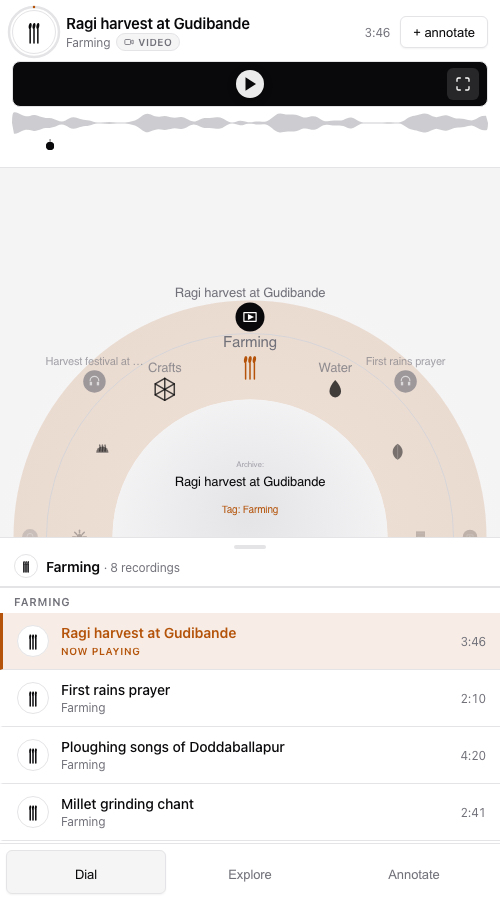
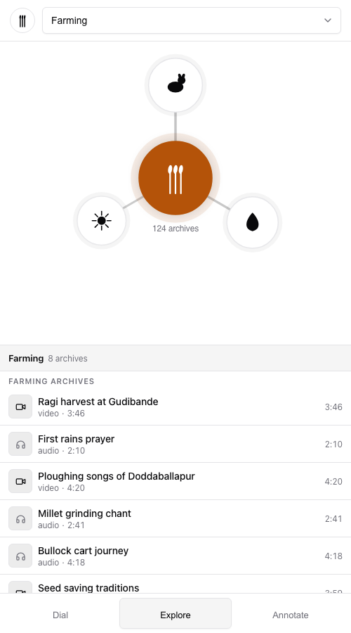
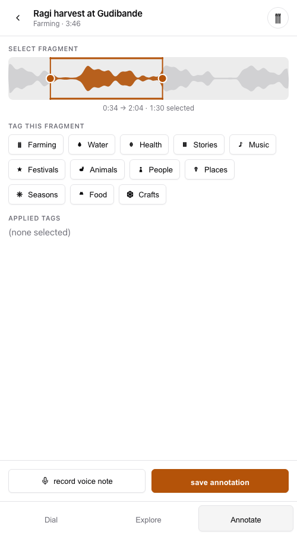

# PLASMA — interface prototype

**An interface prototype and annotation service built in partnership with [Janastu](https://janastu.org/) (Servelots), Bangalore.**

PLASMA (Participatory Listening and Sense-Making of Archives, formerly Papad) is a decentralised hypermedia annotation tool developed by the Indian non-profit Janastu. Designed for low-literacy populations and areas with poor connectivity, it allows users to upload audio and video, tag fragments, and build audiovisual stories without needing to read or write.

The platform emphasises localised storytelling and cultural preservation:

- **Offline-first** — built to function in remote, low-connectivity villages using local Wi-Fi mesh networks.
- **Audio-visual annotation** — lets people document, navigate and annotate stories using only their voice and multimedia.
- **Community driven** — a decentralised archive where communities voice their own perspectives on art, education and local heritage.

You can explore live community archives at the [PLASMA Story Collection](https://stories.janastu.org/collection/40/media/985e5d7b-3374-4ef6-9a09-ebd735a6dc27).

> **Scope of this repository.** This is *not* the canonical PLASMA implementation. Janastu's is at [gitlab.com/servelots/papad](https://dir.floss.fund/view/project/@gitlab.com/servelots/papad/papad-api/-/plasma). This repo is an interface prototype exploring how the archive could be navigated without reading, plus a small Ruby service for the annotation write path. It is offered as a design contribution, and all credit for PLASMA itself belongs to Janastu.

---

## The problem

How do you build a knowledge archive for a community whose knowledge lives in speech, not text?

The deployment target is the village adjacent to Janastu's Iruway Farm near Devarayanadurga, Karnataka, where a COWMesh Wi-Fi mesh already runs. The archive belongs to the village, runs on a Raspberry Pi in the village, and requires no external platform, cloud service, or app store.

That produces hard constraints, and they drive every decision below:

| Constraint | Consequence |
|---|---|
| No internet. Local mesh only. | Every byte needed to render ships in the first response. Zero external hosts. |
| Low-end Android, 2–4 GB RAM | No framework, no runtime. Canvas and vanilla JS. |
| Many users cannot read | Icons, tones and spatial position carry meaning. Text is the secondary channel. |
| Raspberry Pi 4 as the server | SQLite, one file, no daemon. Survives power cuts. |
| Phones offline for days | Annotations queue locally and sync when the mesh returns. |

## How it works

Three views, navigable entirely by icon and position.

| Dial | Explore | Annotate |
|---|---|---|
|  |  |  |
| Rotate through twelve categories on the inner ring and recordings on the outer. Each category has its own icon and its own tone, so the dial can be operated by ear and by shape. | Pick a tag and see which other tags the archive already connects it to, weighted by how often they co-occur. Tapping a petal re-centres the graph. | Drag to select a fragment of the waveform, tag it from the shared vocabulary, and attach a voice note. Fragments use W3C Media Fragment selectors. |

## Architecture

The read path is deliberately **not** on the server.

The archive catalogue ships inline in the shell, so browsing, playback and exploration cost **zero network requests**. On a lossy mesh it is round trips, not bytes, that fail — an interface that needs a request to draw its first frame is an interface that doesn't work in the village.

Ruby owns the write path only:

```
POST /api/annotations              store a tagged fragment (idempotent on client_id)
GET  /api/recordings/:id/annotations
GET  /api/sync?since=<iso8601>     what the archive learned while I was away
GET  /api/health
```

```
lib/plasma/
  archive.rb            catalogue, tag intersection queries
  category.rb           icon, tone, recordings
  recording.rb          media type, duration, waveform peaks, seeded annotations
  waveform.rb           peak generation (stands in for BBC audiowaveform)
  tag_graph.rb          weighted tag co-occurrence
  annotation.rb         W3C fragment selector + validation
  annotation_store.rb   SQLite persistence, idempotent sync
```

**Idempotent writes.** Every annotation carries a client-generated `client_id`. A phone that has been offline for days cannot tell whether its queued writes landed, so it retries; replaying a sync returns the stored row rather than duplicating it.

**Validation is strict and total.** A syncing client learns everything wrong with a queued annotation in one round trip, not one problem per attempt.

## What profiling against the constraints turned up

Measuring the prototype against its own deployment target surfaced four bugs, all now fixed:

- **The interface did not work offline.** The shell fetched its icon library from a CDN. On a mesh with no internet, every category icon silently failed to render — leaving an interface whose first design principle is *icon before text* with no icons at all. A dependency-free canvas icon renderer for all twelve categories already existed in the source, orphaned. It is now the only path, and there are no external hosts left.
- **The player claimed `3:42` for every recording.** The duration in the header was placeholder markup that nothing ever updated.
- **Annotate showed times it did not save.** Fragment times were computed against a hardcoded 222-second duration while the save path used the real one, so the times shown to the user were not the times stored.
- **The annotate header named the wrong recording.** Also placeholder markup, never updated — it always showed the first recording in the archive.

A regression test asserts the shell references no external host, so the offline failure cannot return.

## Design notes

**Five colours.** The palette is five tokens; every other shade is one of them at reduced opacity. The archive originally gave each of the twelve categories its own hue, which does not survive a washed-out screen in direct daylight. Identity moved to icon, tone and position; colour now encodes state only, and the single accent marks what is active.

## Running it

```bash
bundle install
bundle exec puma -p 4567 config.ru   # http://localhost:4567
bundle exec rake test
```

`index.html` at the repo root is the same shell, served statically. Because the read path needs no server, the interface is fully browsable that way — annotations simply stay queued on the device until something is listening at `/api/annotations`. Deep links: `#explore`, `#annotate`.

## Credits

PLASMA is a project of **[Janastu / Servelots](https://janastu.org/)**, Bangalore, deployed with the community at Devarayanadurga, Karnataka. Supported in part by an [APC Advocacy and Institutional Strengthening grant](https://www.apc.org/en/advocacy-and-institutional-strengthening-grants-2024).

This repository contains interface and service work contributed to that project. Design and engineering by Dan Schmidt.

## License

AGPL-3.0, matching the upstream project.
